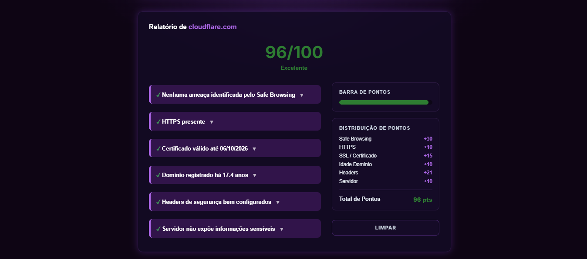
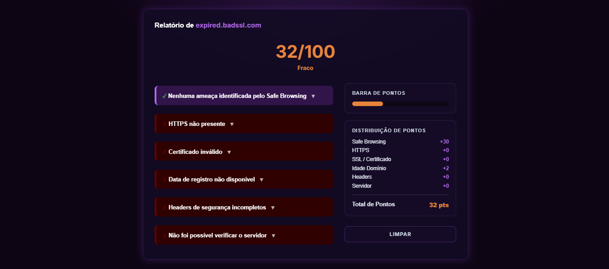

# 🛡️ SecureScan — Verificador de Segurança de Sites

O **SecureScan** é uma ferramenta web desenvolvida em Python e Flask que analisa a confiabilidade de um site com base em diversos critérios de segurança, gerando um relatório detalhado com uma pontuação de 0 a 100.

---

## 🚀 Funcionalidades

O sistema realiza uma varredura em tempo real para analisar os seguintes critérios:
* **Google Safe Browsing:** Consulta uma API do Google, que mantém uma lista de sites já denunciados e confirmados como maliciosos, como páginas de phishing, malware ou golpes.
* **Presença de HTTPS:** Verifica se o site utiliza o protocolo HTTPS em vez do HTTP comum. O HTTPS criptografa a comunicação entre o navegador e o servidor, impedindo que terceiros consigam interceptar ou alterar dados trafegados, como senhas e informações pessoais. A ausência de HTTPS é um forte sinal de que o site não protege adequadamente as informações do usuário.
* **Certificado SSL:** Além de checar se o site usa HTTPS, o sistema valida o certificado SSL associado a ele, verificando se está ativo, correto e dentro do prazo de validade. Um certificado válido garante que a identidade do site é autêntica e que a conexão realmente pertence ao domínio que o usuário está acessando, evitando ataques de falsificação (como sites clonados se passando por outros).
* **Idade do Domínio (RDAP):** Consulta os dados de registro do domínio para identificar há quanto tempo ele existe. Domínios muito novos são usados com frequência em golpes e campanhas de phishing, já que são criados, usados por pouco tempo e depois descartados. Já domínios mais antigos costumam indicar maior estabilidade e confiabilidade — embora isso não seja uma regra absoluta.
* **Headers de Segurança:** Analisa a presença de cabeçalhos HTTP que reforçam a proteção do site contra ataques comuns na web, como HSTS (força o uso de conexão segura), CSP (restringe quais conteúdos podem ser carregados na página), X-Frame-Options (evita ataques de clickjacking, quando o site é escondido dentro de outro para enganar o usuário), X-Content-Type-Options, Referrer-Policy e Permissions-Policy. A ausência desses headers não significa necessariamente que o site é malicioso, mas indica que ele está mais vulnerável a certos tipos de ataque.
* **Informações do Servidor:** Verifica se o servidor expõe dados sensíveis desnecessariamente, como a versão do software utilizado ou a tecnologia por trás do site. Esse tipo de exposição facilita o trabalho de pessoas mal-intencionadas, que podem usar essas informações para identificar vulnerabilidades conhecidas daquela versão específica e planejar um ataque direcionado. Por isso, quanto menos informações técnicas o servidor revelar, mais seguro ele é considerado.

---

## 🛠️ Tecnologias Utilizadas

Para o desenvolvimento deste projeto, utilizamos o seguinte conjunto de tecnologias:

- **Backend:** Python, Flask
- **Frontend:** HTML5, CSS3

---

## 📊 Critérios de Avaliação e Pesos

A pontuação final vai de 0 a 100 e é composta pela soma dos seguintes critérios:

| Critério                    | Peso máximo    |
|-----------------------------|---------------:|
| Google Safe Browsing        | 30 pontos      |
| HTTPS + Certificado SSL     | 25 pontos      |
| Idade do domínio            | 10 pontos      |
| Headers de segurança        | 25 pontos      |
| Informações do servidor     | 10 pontos      |
| **Total**                   | **100 pontos** |


* **Google Safe Browsing (30 pontos):** recebe o maior peso do sistema, já que é o único critério capaz de confirmar diretamente um perigo. Os demais critérios são indícios de segurança, mas não certezas — por isso ficam abaixo dele.

* **HTTPS e Certificado SSL:** o site ganha 10 pontos por ter HTTPS ativo, mais 10 pontos se o certificado for válido, e mais até 5 pontos dependendo de quanto tempo falta para o certificado vencer.

* **Idade do domínio (até 10 pontos):** domínios com mais de dois anos recebem a pontuação máxima, enquanto domínios mais novos são considerados mais suspeitos e recebem menos pontos. Quando essa informação não está disponível, isso não é tratado como sinal de risco — alguns sites ocultam esse dado por questões de privacidade.

* **Headers de segurança (até 25 pontos):** distribuídos entre HSTS, CSP, proteção contra clickjacking (X-Frame-Options), X-Content-Type-Options, Referrer-Policy e Permissions-Policy. Cada header recebe uma pontuação de 2 a 8 pontos, de acordo com sua importância para a segurança do site.

* **Informações do servidor (até 10 pontos):** verifica se o site evita expor detalhes técnicos como número de versão do servidor ou tecnologia utilizada por meio dos cabeçalhos Server e X-Powered-By, cada um conferindo até 5 pontos.

* **Regra de segurança adicional:** caso o Google Safe Browsing identifique o site como uma ameaça, a pontuação final é automaticamente limitada a 15 pontos, independentemente do desempenho nos outros critérios. Isso evita que a ferramenta passe uma falsa sensação de segurança sobre um site perigoso.

---

## 🖱️ Interface e Usabilidade

Para tornar o cálculo da pontuação mais transparente, o SecureScan conta com:

* Uma barra de pontuação visual, que mostra de forma rápida o nível de segurança do site analisado.
* Uma tabela de pontos, detalhando de onde vem cada parte da pontuação final.
* Um botão de limpar relatório, localizado logo abaixo da tabela, que reseta a página para o estado inicial. A mesma ação também pode ser feita clicando na logo do projeto.
* Um histórico com as últimas 5 URLs pesquisadas, localizado logo abaixo do formulário de inserção da URL. As URLs do histórico podem ser clicadas para uma nova verificação, melhorando a experiência de uso.
  
---

## 🕘 Histórico de Verificações

O histórico de sites verificados não utiliza banco de dados. Em vez disso, é armazenado através da session do Flask, mantendo os registros apenas durante a sessão ativa do usuário no navegador. Isso torna a implementação mais simples e dispensa a necessidade de configurar e manter um banco de dados externo.

---

## 📦 Como Instalar e Rodar o Projeto

Siga os passos abaixo para colocar o SecureScan para rodar na sua máquina local:

### 1. Clonar o repositório
```
git clone https://github.com/yadosanjos/SecureScan_Hackoon.git
cd securescan
```

### 2. Instalar as dependências
Certifique-se de ter o Python instalado. No terminal, execute o comando abaixo para instalar todas as bibliotecas necessárias:
```
pip install flask requests python-whois python-dotenv
```

### 3. Configurar a chave da API
Copie o arquivo de exemplo e cole sua própria chave:
```
cp .env.example .env
```

Edite o .env e substitua "sua_chave_aqui" pela sua chave do Google Safe Browsing
(gere a sua em https://developers.google.com/safe-browsing/v4/get-started).

⚠️ O arquivo .env não deve ser commitado — ele já está no .gitignore.

### 4. Executar a aplicação
Para iniciar o servidor local do Flask, execute:
```
python app.py
```

Após rodar o comando, abra o seu navegador e acesse:

👉 `http://127.0.0.1:5000`

---

## ⚠️ Bugs e Limitações Conhecidas

**Primeira verificação inconsistente:** em alguns casos, a primeira verificação de uma URL pode retornar um resultado incorreto. Ao repetir a verificação da mesma URL, o resultado correto costuma aparecer. Acreditamos que isso esteja relacionado a alguma instabilidade de API externa, mas ainda não conseguimos identificar e corrigir a causa exata.

**Precisão não é 100%:** o projeto não acerta todos os critérios o tempo todo, principalmente nas duas últimas verificações (headers de segurança e informações do servidor). Em alguns casos, o verificador pode indicar que um header está ausente quando na verdade ele está presente, ou falhar ao coletar alguma informação do servidor — possivelmente relacionado ao timeout = 5 configurado nas requisições. De forma geral, porém, a ferramenta acerta a maioria dos critérios analisados.

---

## 🌐 Link de Acesso para o Site 

👉 https://securescanvs.vercel.app/

---

## 🖥️ Preview do Projeto





---

## 👥 Desenvolvedoras
- [Laís Silva](https://github.com/lais-ls)
- [Yasmin dos Anjos](https://github.com/yadosanjos)
